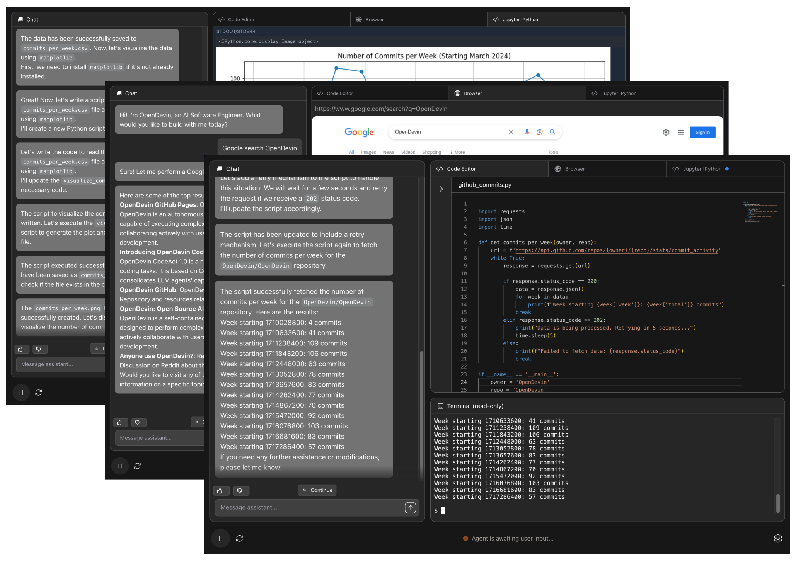

<a name="readme-top"></a>

<div align="center">
  
  <h1 align="center">OpenHands: 写更少代码，创造更多价值</h1>
</div>


<div align="center">
  <a href="https://github.com/All-Hands-AI/OpenHands/graphs/contributors"></a>
  <a href="https://github.com/All-Hands-AI/OpenHands/stargazers"></a>
  <a href="https://codecov.io/github/All-Hands-AI/OpenHands?branch=main"></a>
  <a href="https://github.com/All-Hands-AI/OpenHands/blob/main/LICENSE"></a>
  <br/>
  <a href="https://join.slack.com/t/openhands-ai/shared_invite/zt-2ypg5jweb-d~6hObZDbXi_HEL8PDrbHg"></a>
  <a href="https://discord.gg/ESHStjSjD4"></a>
  <a href="https://github.com/All-Hands-AI/OpenHands/blob/main/CREDITS.md"></a>
  <br/>
  <a href="https://docs.all-hands.dev/modules/usage/getting-started"></a>
  <a href="https://arxiv.org/abs/2407.16741"></a>
  <a href="https://huggingface.co/spaces/OpenHands/evaluation"></a>
  <hr>
</div>

欢迎使用OpenHands（前身为OpenDevin），这是一个由AI驱动的软件开发代理平台。

OpenHands代理可以完成人类开发者能做的任何事情：修改代码、运行命令、浏览网页、调用API，当然——也包括从StackOverflow复制代码片段。

在[docs.all-hands.dev](https://docs.all-hands.dev)了解更多信息，或直接跳转到[快速开始](#-quick-start)。

> [!IMPORTANT]
> 在工作中使用OpenHands？我们很想和您交流！填写
> [这份简短表单](https://docs.google.com/forms/d/e/1FAIpQLSet3VbGaz8z32gW9Wm-Grl4jpt5WgMXPgJ4EDPVmCETCBpJtQ/viewform)
> 加入我们的设计伙伴计划，您将获得商业功能的早期访问权限，并有机会为我们的产品路线图提供建议。



## ⚡ 快速开始

运行OpenHands最简单的方式是使用Docker。
查看[运行OpenHands](https://docs.all-hands.dev/modules/usage/installation)指南了解
系统要求和更多信息。

```bash
docker pull docker.all-hands.dev/all-hands-ai/runtime:0.27-nikolaik

docker run -it --rm --pull=always \
    -e SANDBOX_RUNTIME_CONTAINER_IMAGE=docker.all-hands.dev/all-hands-ai/runtime:0.27-nikolaik \
    -e LOG_ALL_EVENTS=true \
    -v /var/run/docker.sock:/var/run/docker.sock \
    -v ~/.openhands-state:/.openhands-state \
    -p 3000:3000 \
    --add-host host.docker.internal:host-gateway \
    --name openhands-app \
    docker.all-hands.dev/all-hands-ai/openhands:0.27
```

您可以在[http://localhost:3000](http://localhost:3000)找到正在运行的OpenHands！

最后，您需要一个模型提供商和API密钥。
[Anthropic的Claude 3.5 Sonnet](https://www.anthropic.com/api)（`anthropic/claude-3-5-sonnet-20241022`）
效果最好，但您还有[其他选择](https://docs.all-hands.dev/modules/usage/llms)。

---

您还可以[将OpenHands连接到本地文件系统](https://docs.all-hands.dev/modules/usage/runtimes#connecting-to-your-filesystem)，
在可编程的[无头模式](https://docs.all-hands.dev/modules/usage/how-to/headless-mode)下运行OpenHands，
通过[友好的命令行界面](https://docs.all-hands.dev/modules/usage/how-to/cli-mode)与其交互，
或者使用[GitHub Action](https://docs.all-hands.dev/modules/usage/how-to/github-action)在带标签的问题上运行它。

访问[运行OpenHands](https://docs.all-hands.dev/modules/usage/installation)获取更多信息和设置说明。

> [!CAUTION]
> OpenHands 设计为由单个用户在其本地工作站上运行。
> 它不适合多租户部署，即多个用户共享同一个实例。它没有内置的隔离或可扩展性。
>
> 如果您有兴趣在多租户环境中运行 OpenHands，请
> [联系我们](https://docs.google.com/forms/d/e/1FAIpQLSet3VbGaz8z32gW9Wm-Grl4jpt5WgMXPgJ4EDPVmCETCBpJtQ/viewform)
> 了解高级部署选项。

如果您想修改 OpenHands 源代码，请查看 [Development.md](https://github.com/All-Hands-AI/OpenHands/blob/main/Development.md)。

遇到问题？[故障排除指南](https://docs.all-hands.dev/modules/usage/troubleshooting)可以帮助您。

## 📖 文档

要了解更多关于项目的信息，以及使用 OpenHands 的技巧，
请查看我们的[文档](https://docs.all-hands.dev/modules/usage/getting-started)。

在那里您可以找到关于如何使用不同的 LLM 提供商的资源、
故障排除资源和高级配置选项。

## 🤝 如何加入社区

OpenHands 是一个社区驱动的项目，我们欢迎每个人的贡献。我们主要通过
Slack 进行交流，所以这是最好的起点，但我们也很乐意您通过 Discord 或 Github 联系我们：

- [加入我们的 Slack 工作空间](https://join.slack.com/t/openhands-ai/shared_invite/zt-2ypg5jweb-d~6hObZDbXi_HEL8PDrbHg) - 在这里我们讨论研究、架构和未来发展。
- [加入我们的 Discord 服务器](https://discord.gg/ESHStjSjD4) - 这是一个社区运营的服务器，用于一般讨论、问题和反馈。
- [阅读或发布 Github Issues](https://github.com/All-Hands-AI/OpenHands/issues) - 查看我们正在处理的问题，或添加您自己的想法。

在 [COMMUNITY.md](./COMMUNITY.md) 中了解更多关于社区的信息，或在 [CONTRIBUTING.md](./CONTRIBUTING.md) 中找到贡献的详细信息。

## 📈 进展

在[这里](https://github.com/orgs/All-Hands-AI/projects/1)查看 OpenHands 的月度路线图（在每月底的维护者会议上更新）。

<p align="center">
  <a href="https://star-history.com/#All-Hands-AI/OpenHands&Date">
    
  </a>
</p>

## 📜 许可证

基于 MIT 许可证分发。查看 [`LICENSE`](./LICENSE) 获取更多信息。

## 🙏 致谢

OpenHands 由众多贡献者构建，我们非常感谢每一份贡献！我们也基于其他开源项目进行构建，对他们的工作深表感谢。

有关 OpenHands 使用的开源项目和许可证列表，请参阅我们的 [CREDITS.md](./CREDITS.md) 文件。

## 📚 引用

```
@misc{openhands,
      title={{OpenHands: 一个面向AI软件开发者的通用型智能体开放平台}},
      author={Xingyao Wang and Boxuan Li and Yufan Song and Frank F. Xu and Xiangru Tang and Mingchen Zhuge and Jiayi Pan and Yueqi Song and Bowen Li and Jaskirat Singh and Hoang H. Tran and Fuqiang Li and Ren Ma and Mingzhang Zheng and Bill Qian and Yanjun Shao and Niklas Muennighoff and Yizhe Zhang and Binyuan Hui and Junyang Lin and Robert Brennan and Hao Peng and Heng Ji and Graham Neubig},
      year={2024},
      eprint={2407.16741},
      archivePrefix={arXiv},
      primaryClass={cs.SE},
      url={https://arxiv.org/abs/2407.16741},
}
```
